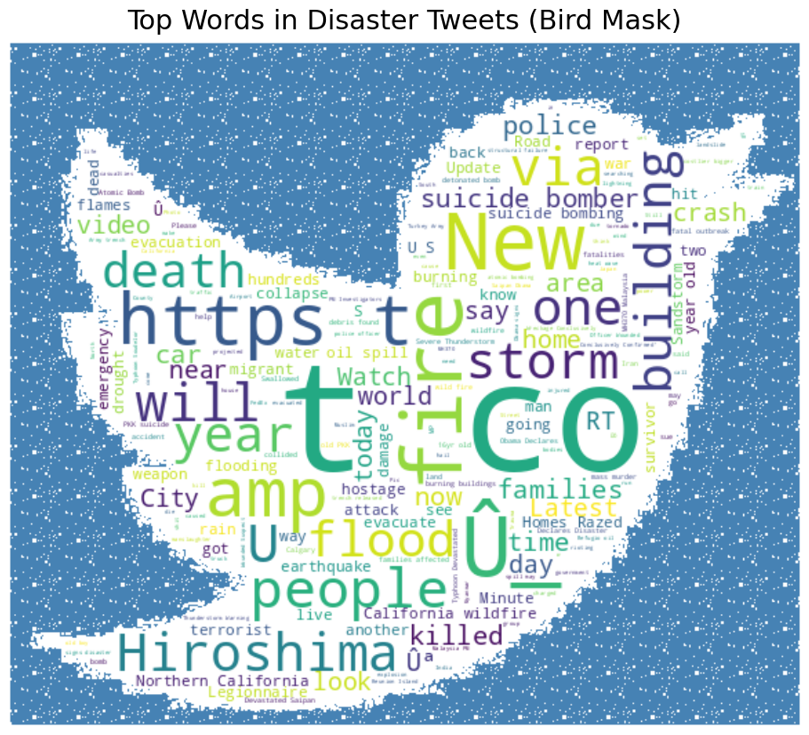

# 🌀 NLP with Disaster Tweets



## 📌 Project Overview

This project focuses on classifying tweets to determine whether they refer to real-world disasters. The model enables improved emergency response, real-time crisis monitoring, and insights from social media data. It leverages a combination of classical machine learning and deep learning techniques, including hybrid models that incorporate both text and structured data inputs.

---

## 🗂️ Table of Contents

- [Project Structure](#project-structure)
- [Dataset Overview](#dataset-overview)
- [Exploratory Data Analysis (EDA)](#exploratory-data-analysis-eda)
- [Data Preprocessing](#data-preprocessing)
- [Modeling Approaches](#modeling-approaches)
- [Model Evaluation](#model-evaluation)
- [Visualizations](#visualizations)
- [Key Findings](#key-findings)
- [Recommendations](#recommendations)
- [Installation](#installation)
- [Usage](#usage)
- [Contributors](#contributors)
- [License](#license)

---

## 📁 Project Structure

```plaintext
project-root/
│
├── data/
│   ├── train.csv
│   └── test.csv
│
├── notebooks/
│   └── Project_NLP_with_Disaster_Tweets_v_2.ipynb
│
├── outputs/
│   ├── BiLSTM-Based Hybrid ModelSchema.drawio.png
│   ├── Model Comparison Radar Chart.png
│   └── Twitt.png
│
├── reports/
│   └── Project_report_Disaster_tweet.pdf
│
├── README.md
└── requirements.txt
```

---

## 📊 Dataset Overview

- **Source**: Kaggle ([NLP with Disaster Tweets](https://www.kaggle.com/competitions/nlp-getting-started))
- **Format**: `train.csv`
  - `text`: Tweet content
  - `keyword`: Optional disaster-related keyword
  - `location`: Optional user-defined location
  - `target`: Binary label (1: disaster, 0: non-disaster)

---

## 🔍 Exploratory Data Analysis (EDA)

- **Missing Values**:
  - `text` and `target`: None
  - `keyword`: ~60 missing (filled/dropped)
  - `location`: ~33% missing (excluded in text-only models)
- **Distribution**:
  - Imbalanced classes: ~57% non-disaster, 43% disaster
- **Tweet Length**: Mostly <140 characters
- **Keyword Insight**: High correlation of keywords like *fire*, *earthquake*, *accident* with disaster tweets

---

## 🧹 Data Preprocessing

- Lowercased text
- Removed punctuation, URLs, mentions, hashtags, stopwords
- Tokenized, lemmatized, and stemmed
- Encoded with:
  - TF-IDF (ML models)
  - Tokenizer + padding (Deep models)
  - BERT tokenizer (Transformer models)

---

## 🧠 Modeling Approaches

### 1. Text-Only Pipeline
- **Input**: `text` column  
- **Used for**: TF-IDF + ML models and BERT  
- **Encoding**: TF-IDF or BERT tokenizer  
- **Pros**: Simplicity, low preprocessing cost  

### 2. Hybrid Pipeline
- **Inputs**: `text`, `keyword`, `location`, text metadata  
- **Used for**: CNN, BiLSTM with auxiliary structured features  
- **Architecture**:  
  - Branch 1: Embedding → Conv1D/BiLSTM → Pooling  
  - Branch 2: Structured features → Dense  
  - Combined: Concatenate → Dense → Output  


---

## 📈 Model Evaluation

All models were evaluated using:
- **Accuracy**
- **Precision**
- **Recall**
- **F1-Score**

---

## 📊 Visualizations

### Model Comparison Radar Chart


---

## 🔑 Key Findings

- **Top classical model**: Logistic Regression
- **Best recall**: BERT (0.77), BiLSTM (0.74)
- **Best precision**: SVM (0.86), CNN (0.88)
- **Most balanced**: BiLSTM, Logistic Regression
- **Best lightweight**: Naive Bayes
- **Worst performers**: KNN, PCA + Logistic Regression

---

## ✅ Recommendations

| Business Scenario                            | Recommended Model         | Reason                                                                 |
|---------------------------------------------|----------------------------|------------------------------------------------------------------------|
| Minimize missed disasters (High Recall)     | BERT, BiLSTM               | Detects most true disaster tweets                                      |
| Minimize false positives (High Precision)   | SVM, Dual Input CNN        | Fewest incorrect disaster flags                                        |
| Balanced classification (F1-Score)          | BiLSTM, Logistic Regression| Balanced performance, interpretable                                    |
| Fast & simple deployment                    | Logistic Regression, NB    | Lightweight, accurate, easy to maintain                               |
| Scalability with high-volume data           | XGBoost                    | Scalable, high performance                                             |

---

## ⚙️ Installation

1. Clone the repository:
   ```bash
   git clone https://github.com/Kovalivska/disaster-tweet-classification.git
   cd disaster-tweet-classification
   
   ```

2. Install dependencies:
   ```bash
   pip install -r requirements.txt
   ```

---

## 🚀 Usage

1. **Launch Jupyter Notebook**:
   ```bash
   jupyter notebook
   ```

2. **Open and run**:
   Navigate to `notebooks/Project_NLP_with_Disaster_Tweets_v_2.ipynb` and execute all cells sequentially.

3. **Outputs**:
   - All results (visuals, diagrams) are saved in the `outputs/` folder.
   - Final project summary is provided in the `reports/` folder.

---

## 👥 Contributors

 Svitlana Kovalivska – Data Scientist & Developer  


---

## 📜 License

This project is licensed under the MIT License. See the [LICENSE](./LICENSE) file for details.
